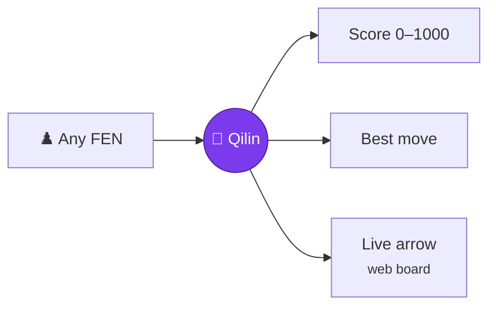
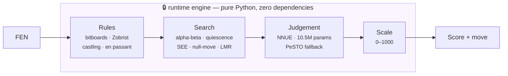
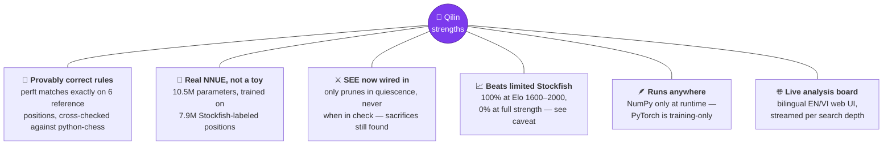
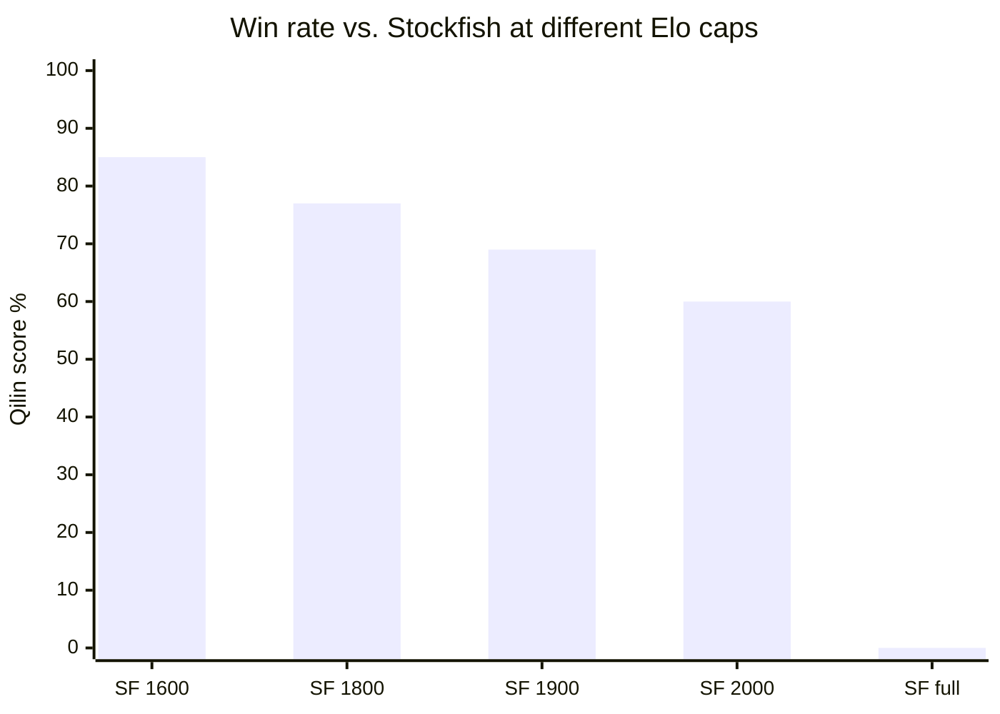
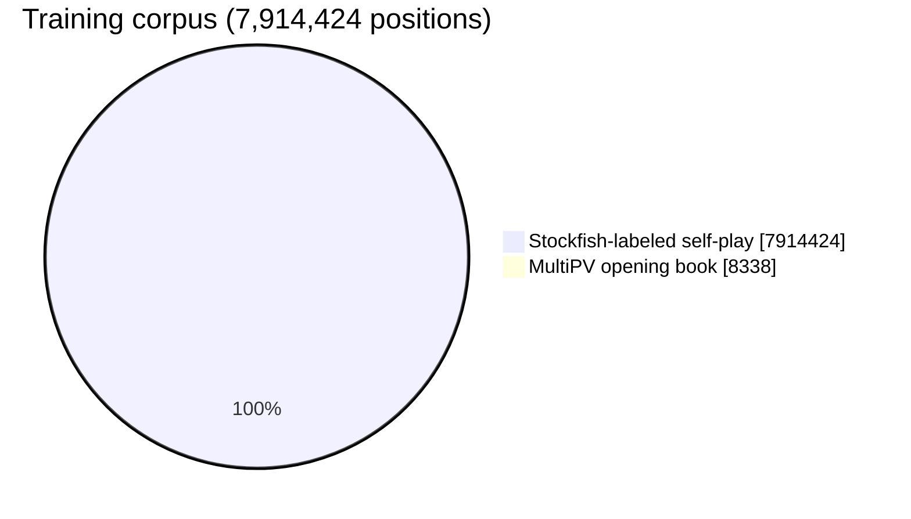
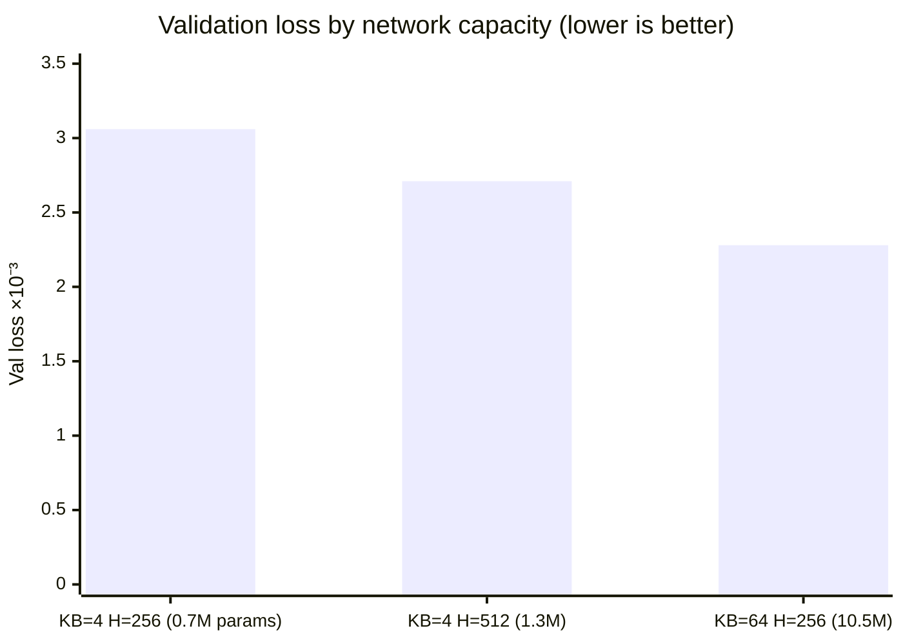
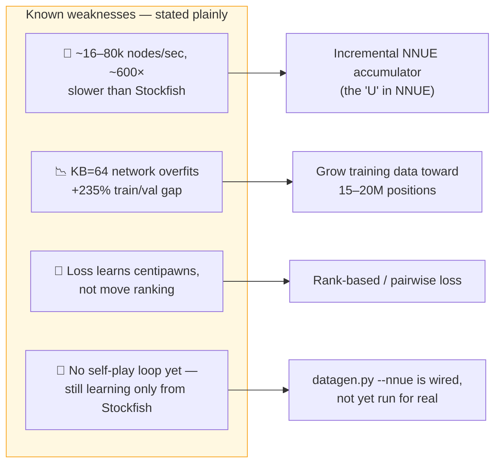
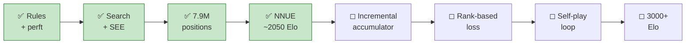

<div align="center">

# Qilin — Chess Engine v1

### A chess engine built from Neural Networks and Python

No chess library. No borrowed engine. Every rule, every search, every evaluation — written from scratch.


</div>

---

## Table of Contents

| Section | |
|---|---|
| [What It Is](#what-it-is) | The idea in 30 seconds |
| [How It Thinks](#how-it-thinks) | Four layers, one clean boundary |
| [Strengths](#strengths) | What's already measured and working |
| [Measured Results](#measured-results) | The Elo ladder, the training data, the honest surprises |
| [Under Repair](#under-repair) | Known weaknesses, stated plainly |
| [What's Coming](#whats-coming) | Development roadmap |
| [Try It](#try-it) | Run it yourself |
| [File Map](#file-map) | Where everything lives |

---

## What It Is

Show Qilin any chess position. It answers with **one number from 0 to 1000** — how good
that position is for White — and the move it would play, live, with an arrow.

> **A note on the Elo numbers below, upfront:** they come from Stockfish's
> `UCI_LimitStrength` mode, which is calibrated to imitate *human* mistakes, not a
> genuine engine of that rating. Playing against another engine, that imitation can be
> exploited very differently than a real 1600–2000 Elo player would be — see
> [Measured Results](#measured-results) for the actual data and why we don't trust the
> extrapolated "Qilin Elo" column as a real number.



| 1000 | 505 | 500 | 0 |
|:---:|:---:|:---:|:---:|
| White mates **this move** | opening position | dead level | Black mates this move |

> **S = 1000 × White's expected outcome** (win = 1, draw = 0.5, loss = 0). The 505 anchor
> isn't an added constant — it's a calibration that makes the starting position always
> come out to exactly 505, no matter which evaluator is plugged in underneath.

## How It Thinks



Four independent layers. The scale can be recalibrated without touching judgement;
judgement can be swapped between the neural network and the handcrafted evaluator
without touching search or rules at all.

```bash
python3 check_purity.py    # actually boots the engine with `chess` blocked at sys.meta_path
```

`python-chess` and Stockfish are only ever used in the **training** pipeline
(`datagen_sf.py`, `make_book.py`, `play_stockfish.py`) — never in the engine that
actually plays. This boundary is enforced by code, not convention: `check_purity.py`
walks the AST to catch real imports, then boots the engine with `chess` blocked at
`sys.meta_path` so even a hidden dependency gets caught.

## Strengths



**Every claim below is a number that was actually measured, not assumed** — including the
ones that turned out embarrassing (see [Under Repair](#under-repair)).

## Measured Results

### The Elo ladder — and why the "Elo" column is not trustworthy

Real games against **Stockfish 18**, strength-limited via `UCI_LimitStrength`, 2.0 seconds
per move on both sides, openings paired (each book position played twice with colors
swapped, so every result is exactly balanced by color).

**The raw win rates are real.** The "estimated Qilin Elo" column is not — it's the classic
Elo-model extrapolation from a single game's win rate, and here's the tell that it's
wrong: if Qilin had one fixed Elo, all four estimates below should land close together.
They don't. They climb steadily with the opponent's rating (1901 → 2010 → 2039 → 2069),
which the Elo model says shouldn't happen. That drift, plus going 100% at Elo 1600–2000
and then **0/10** at full strength — too sharp a cliff for a smooth Elo curve — points to
the same root cause: `UCI_LimitStrength` is calibrated to imitate *human* weaknesses, not
a genuine engine of that rating, so it doesn't behave like a real opponent of that Elo when
the other side is a machine.



| Opponent | Score | Rate | Estimated Qilin Elo |
|---|:---:|:---:|:---:|
| Stockfish (Elo 1600) | 85.0 / 100 | 85.0% | ≈ 1901 |
| Stockfish (Elo 1800) | 77.0 / 100 | 77.0% | ≈ 2010 |
| Stockfish (Elo 1900) | 69.0 / 100 | 69.0% | ≈ 2039 |
| Stockfish (Elo 2000) | 52.0 / 87 | 59.8% | ≈ 2069 |
| Stockfish (**full strength**) | 0.0 / 10 | 0% | swept |

**→ What can honestly be claimed: Qilin reliably beats Stockfish limited to 1600–2000
Elo, and loses every game against Stockfish at full strength.** Anything more precise
than that (a single Elo number) would need a rating pool of real, independently-rated
engines to anchor against — which this repository does not yet have. Running at only
~16–80 thousand nodes/second in pure Python (roughly **600× slower** than Stockfish
itself) is the more concrete, trustworthy fact about where Qilin stands.

### The training data



### The architecture experiment — capacity, not data, was the bottleneck

Same 7.91M positions, same validation split (fixed seed), only the network size changed:



Doubling the *data* on the small network improved nothing. Growing the network's
*capacity* on the same data cut validation loss by 25%. That's the current architecture.

### The honest surprise

The network matches Stockfish's own evaluations **16% more accurately** than the
handcrafted evaluator — yet performs **no better** in a same-node match against it.
Raw accuracy doesn't automatically become playing strength, because alpha-beta only
needs the correct *relative ordering* between moves, not the exact number. This is why
the roadmap includes switching to a rank-based training objective.

### SEE, measured

Static Exchange Evaluation — used for move ordering everywhere, but only allowed to
prune a move inside quiescence search, and only when **not in check**, so a forcing
sacrifice sequence can never be wrongly discarded:

| Metric | Before SEE | After SEE (with cheap pre-filter) |
|---|:---:|:---:|
| Nodes searched (fixed positions) | baseline | **−7%** |
| Wall-clock time | baseline | **−6% (faster)** |
| Head-to-head vs. no-SEE, same time budget | — | **≈ +115 to +120 Elo**, converging over 120+ paired games |

Three known sacrifice combinations (queen sac, bishop sac, rook maneuver mates)
were played out move-by-move to a real checkmate to confirm SEE never blinds the
engine to them.

## Under Repair



Nothing here is hidden. Every number in [Measured Results](#measured-results) came from
a script you can rerun yourself (`play_stockfish.py`, `match.py`, `train.py`) — there is
no strength claim in this repository that wasn't produced by an actual game being played.

## What's Coming



## Try It

```bash
# 🌐 web analysis board (recommended) — auto-picks the latest weights, opens the browser
./serve.sh
./serve.sh --hand                              # handcrafted evaluator only, no NNUE needed
./serve.sh --nnue weights/cap_kb64_h256.npz --port 8080

# ⌨️ command line
python3 main.py "<FEN>" --depth 10
python3 main.py --moves e2e4 e7e5 g1f3
python3 main.py --interactive

# ✅ verify everything yourself
python3 test_engine.py     # 97 tests: perft, Zobrist, draw rules, SEE, scoring scale
python3 check_purity.py    # proves the engine never touches an external chess library
```

Nothing to install beyond NumPy to *run* the engine — PyTorch is only needed for
training a new network.

```bash
# 🎓 training pipeline (torch required)
python3 make_book.py --count 8000 --workers 7
python3 datagen_sf.py --games 400000 --epd data/book.epd --out data/sf.txt.gz
NNUE_KING_BUCKETS=64 python3 -u train.py --data data/sf.txt.gz --lambda 1.0
python3 play_stockfish.py --games 100 --ladder 1600,1800,2000,2200 --time 2.0 --nnue weights/x.npz
```

## File Map

| File | Role |
|---|---|
| `chess_core.py` | Bitboards, move generation, make/unmake, FEN, Zobrist, `Game` |
| `search.py` | Negamax + alpha-beta, TT, quiescence, SEE, null-move, LMR |
| `evaluate.py` | Handcrafted PeSTO evaluation |
| `scoring.py` | cp → 0..1000 mapping, 505-anchor calibration |
| `nnue.py` | Feature extraction, NumPy inference, PyTorch model |
| `main.py` | CLI scorer |
| `server.py` + `web/` | Live bilingual analysis board, best-move arrows |
| `serve.sh` | Launches the analysis board |
| `test_engine.py` | 97 regression tests across 15 groups |
| `check_purity.py` | Enforces the external-library boundary |
| `datagen_sf.py` | Data generation, Stockfish labeling |
| `make_book.py` | Opening book via MultiPV |
| `train.py` | NNUE training |
| `match.py` | Head-to-head between two evaluators |
| `play_stockfish.py` | Real games against Stockfish, PGN export, Elo ladder |

---

## Acknowledgments

Qilin's runtime engine never imports either of these — see
[How It Thinks](#how-it-thinks) — but the **training pipeline** leans on both, and that
deserves a proper thank-you:

- **[Stockfish](https://stockfishchess.org/)** — the real Stockfish 18 binary labels every
  one of the 7.9M training positions and plays every opponent in the Elo ladder. Qilin's
  NNUE is trained on its judgement; none of its code is used or redistributed.
- **[python-chess](https://python-chess.readthedocs.io/)** — powers move validation, PGN
  export, and UCI plumbing in the training/testing tooling (`datagen_sf.py`,
  `play_stockfish.py`, `check_purity.py`'s own cross-validation). Never imported by the
  engine that actually plays.

---

<div align="center">

*License: MIT — see [`LICENSE`](LICENSE).*

</div>
